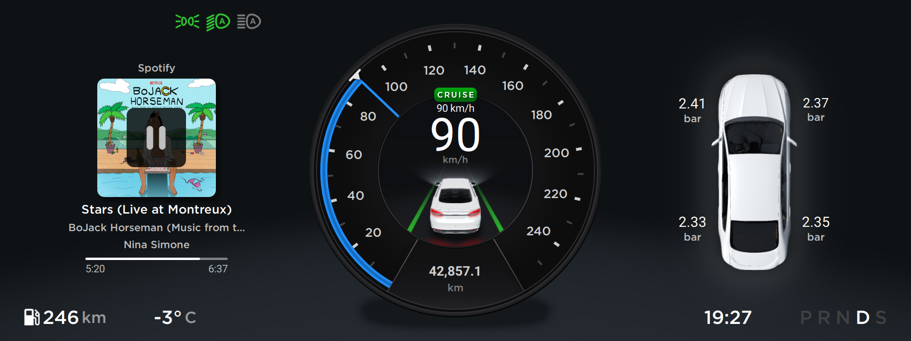
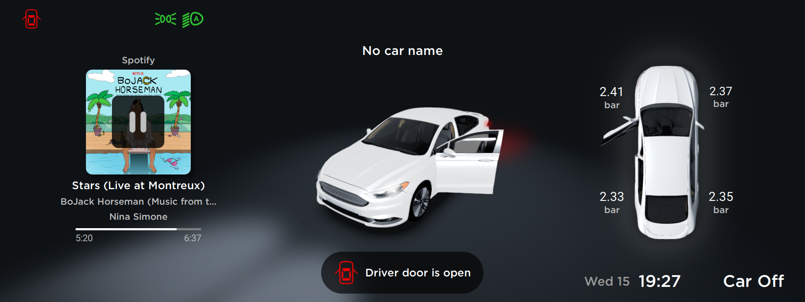
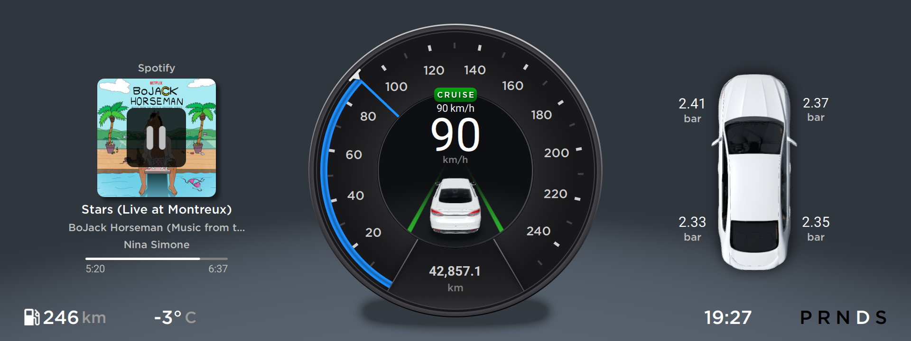
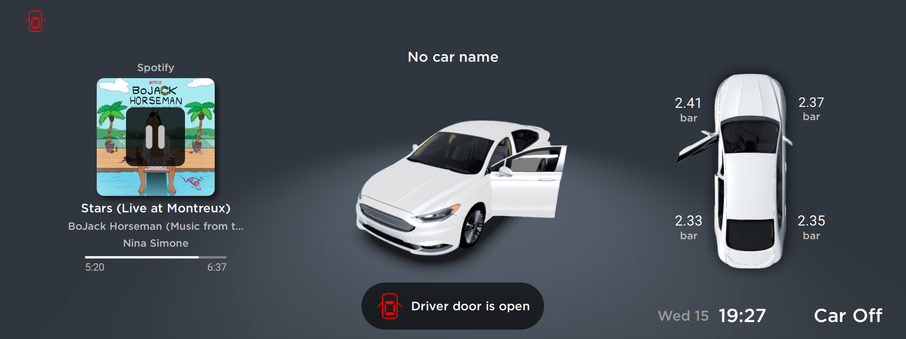

# Disclaimer
*The code is provided for **educational purposes only**, and the use of the code/parts of the code for **commercial purposes is not permitted**.*

*The provided code was used only for the demo videos and **does not represent the actual software functionality**.*

***The code is up to date as of the date of publication, June 1, 2025, and will not be maintained.***
 
*Due to copyright reasons, some items may be missing in the repository. For example: fonts, icons, sounds, etc.
This may affect the build/use of the project. Replace these items if necessary.*

# Info
Custom Instrument Cluster written on Qt 6, currently works on Raspberry Pi Compute Module 4 with Raspbian.

To interact with CAN bus, i developed my custom gateway running on STM32+FreeRTOS.

Interaction with climate, car settings, and other systems without any issues, there are no DTCs in vehicle modules, full emulation of the original factory instrument cluster.

For displaying the navigation map and navigation instructions, i using my custom multimedia system, which is under development.

More information and videos coming soon.
# Demo
[In-Vehicle demo](https://youtu.be/5xK9Aua130s "In-Vehicle demo")

[Bench demo](https://youtu.be/i1HMDwnfqPg "Bench demo")
# Screenshots

